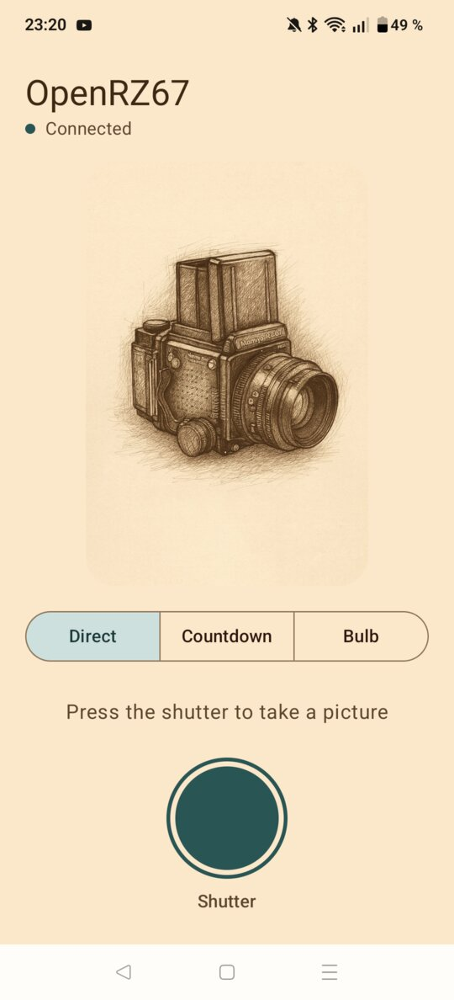
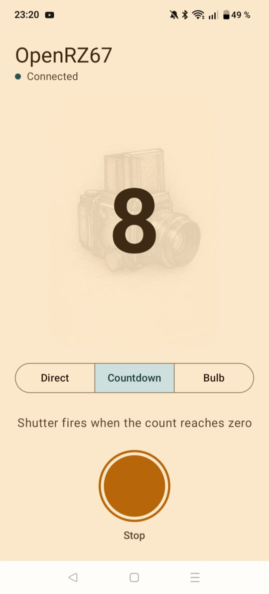
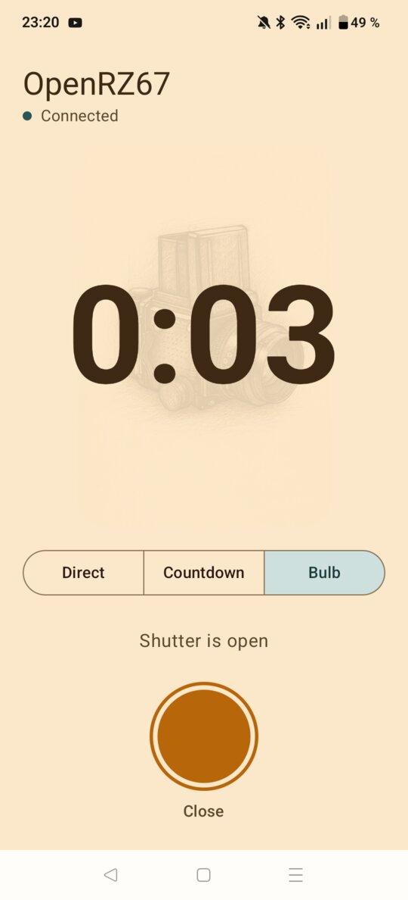
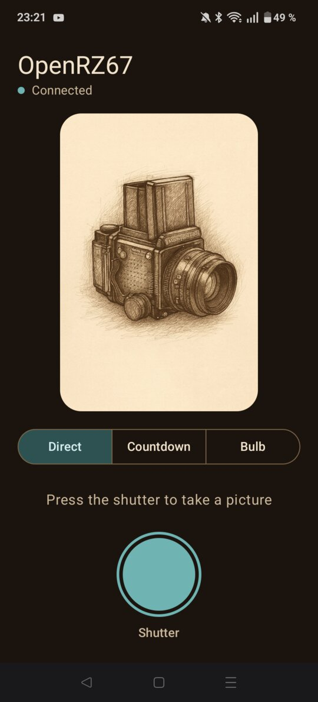

# OpenRZ67 for Android
This is an Android app for controlling the [openrz67-trigger](https://github.com/openrz67/openrz67-trigger) bluetooth remote trigger for the Mamiya RZ67 camera.

## Status:
The app works as intended for my use case, but I'm sure there are lots of improvements to be made or bugs to be ironed out. Pull requests welcome.

## Features:
- Automatically connects to the openrz67-trigger, and re-connects if connection is broken
- Trigger the camera using the shutter button
- Trigger a delayed trigger with a user specified countdown
- Trigger bulb mode. The trigger only holds the release; the camera must be set to B (bulb), or it just takes one normal picture at the dialed speed

## Installation:
Check out [releases](https://github.com/openrz67/openrz67-android/releases/), or clone the repo and build it yourself.

## Look & feel
Follows the system light/dark setting.

   
